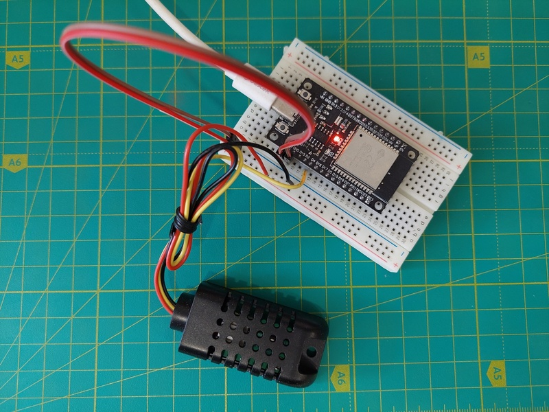
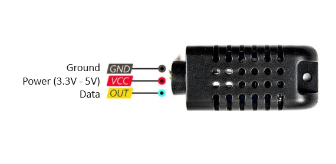

# AM2301-DHT21 Sensor Interface Component

## Overview

This component provides an interface for the AM2301-DHT21 temperature and humidity sensor using the ESP-IDF framework. It supports initializing the sensor, reading temperature and humidity data, and handling communication errors.



## Features

- **Initialize Sensor**: Configure GPIO for sensor communication.
- **Read Data**: Poll the sensor to retrieve temperature and humidity readings.
- **Error Handling**: Includes basic error handling for data acquisition and checksum validation.

## Dependencies

- ESP-IDF (Espressif IoT Development Framework)
  This project is compatible (tested) with ESP-IDF versions 4.4.8 and 5.2.2.
- FreeRTOS Libraries
  Necessary for multitasking and real-time operations within the ESP32 environment.

## License

This component is released under the MIT License. See the LICENSE file for details. You are free to use, modify, and distribute this code as long as the license is included in all copies or substantial portions of the code.
[LICENSE](LICENSE.txt)

## Disclaimer

This component is provided "as is", without warranty of any kind. The authors are not liable for any damages arising from the use of this component. Use it at your own risk.

## Author

Andrii Solomai

## Installation

1. **Clone the repository:**

   ```bash
   git clone <repository-url>

2. **Include the component in your ESP-IDF project:**

Add the path to the component in your project's CMakeLists.txt or component.mk file.
set(EXTRA_COMPONENT_DIRS /path/to/am2301-dht21)

3. **Include the header file in your source code:**
#include "am2301.h"

## API Functions

### `am2301_context_t* am2301_init(gpio_num_t pin)`

Initializes the AM2301-DHT21 sensor.

**Parameters:**
- `pin`: GPIO number connected to the AM2301-DHT21 sensor.

**Returns:**
- Pointer to the sensor context, or `NULL` if initialization fails.

---

### `bool am2301_free(am2301_context_t* context)`

Frees resources allocated for the AM2301-DHT21 sensor.

**Parameters:**
- `context`: Pointer to the sensor context to be freed.

**Returns:**
- `true` if resources were successfully freed, `false` otherwise.

---

### `bool am2301_poll_temperature(am2301_context_t *context, float *temperature)`

Polls the sensor to retrieve the temperature.

**Parameters:**
- `context`: Pointer to the sensor context.
- `temperature`: Pointer to a float where the temperature value will be stored.

**Returns:**
- `true` if the temperature was successfully retrieved, `false` otherwise.

---

### `bool am2301_poll_humidity(am2301_context_t *context, float *humidity)`

Polls the sensor to retrieve the humidity.

**Parameters:**
- `context`: Pointer to the sensor context.
- `humidity`: Pointer to a float where the humidity value will be stored.

**Returns:**
- `true` if the humidity was successfully retrieved, `false` otherwise.

---

### `bool am2301_poll_data(am2301_context_t *context, float *temperature, float *humidity)`

Polls the sensor to retrieve both temperature and humidity.

**Parameters:**
- `context`: Pointer to the sensor context.
- `temperature`: Pointer to a float where the temperature value will be stored.
- `humidity`: Pointer to a float where the humidity value will be stored.

**Returns:**
- `true` if both temperature and humidity were successfully retrieved, `false` otherwise.


## Sensor pinout
Pinout of AM2301 (DHT21) Module
Red wire: positive pin of the module power supply (3.3 to 5.5 volts)
Black wire: ground
Yellow wire: data line (must be connected to one of the digital pins of the microcontroller)



For detailed documentation, refer to the following PDF document:
[Temperature and humidity module AM2301 Product Manual](docs/AM2301.pdf)

